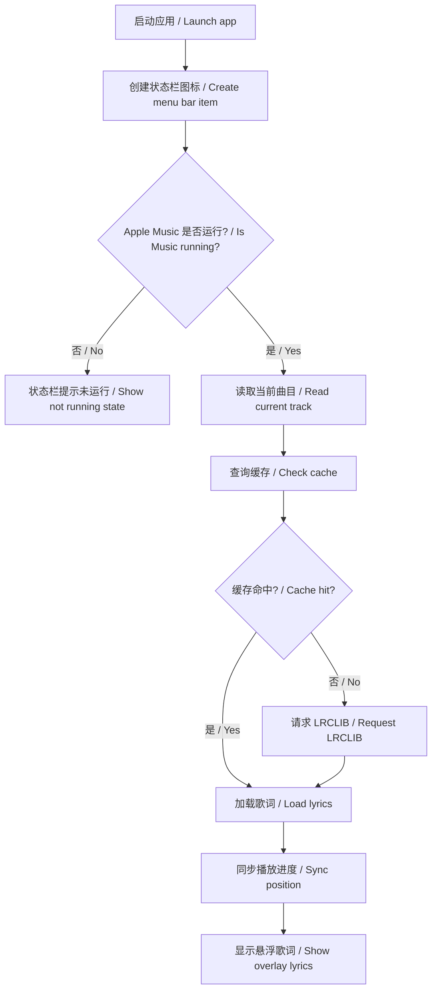
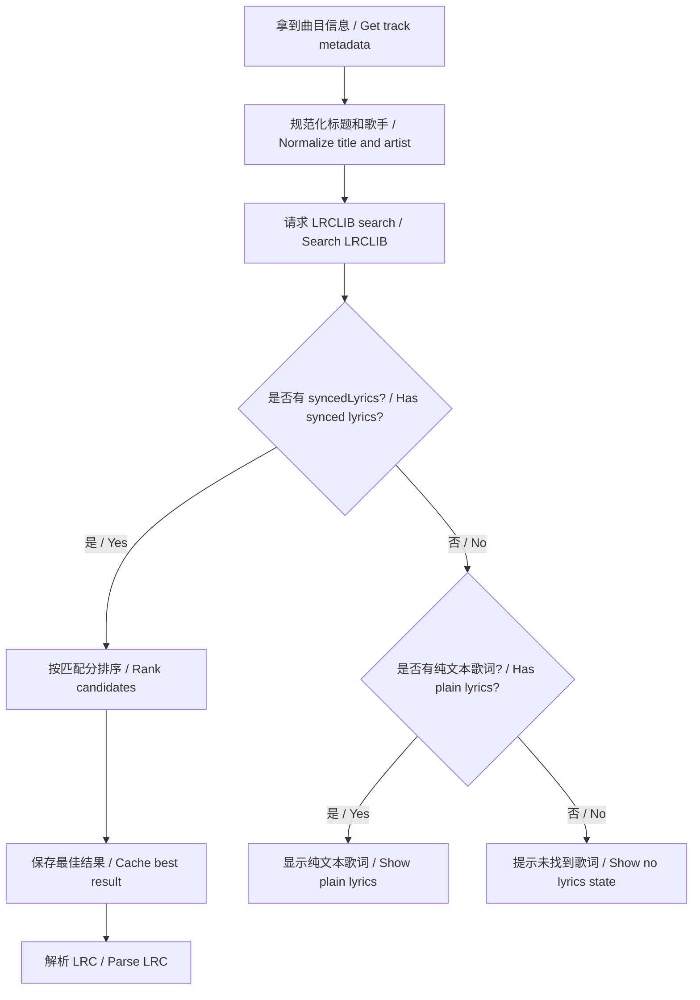
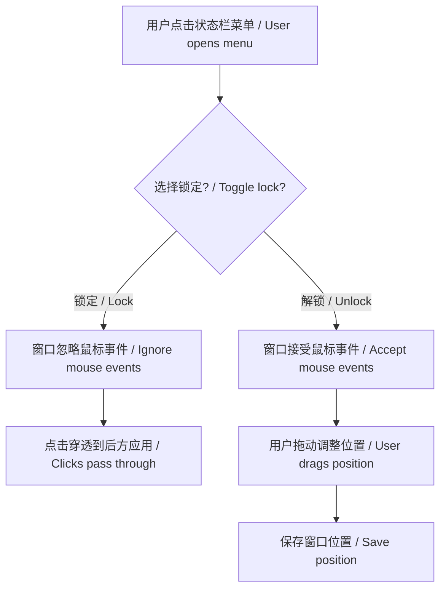

# Apple Music 桌面歌词插件产品需求文档 / Product Requirements Document

## 1. 文档概述 / Document Overview

| 项目 | 内容 |
|------|------|
| 文档名称 | Apple Music 桌面歌词插件 PRD |
| Document | Apple Music Desktop Lyrics Plugin PRD |
| 版本号 | v0.1.0 |
| 创建日期 | 2026-05-22 |
| 文档状态 | 评审中 |
| 编写人 | Codex |
| 目标读者 | 产品、开发、测试、设计、后续维护者 |

文档目的：定义一个 macOS Apple Music 桌面悬浮歌词插件的第一版需求、核心流程、界面要求、技术约束和验收标准。

Purpose: define the first version requirements, flows, UI expectations, technical constraints, and acceptance criteria for a macOS Apple Music desktop lyrics overlay.

## 2. 需求背景 / Background

国内主流音乐软件普遍提供桌面歌词，但 macOS Apple Music 缺少类似的原生悬浮歌词体验。用户希望在不切换窗口、不打开 Apple Music 歌词页的情况下，在桌面上持续看到当前播放歌曲的同步歌词。

Many Chinese music apps provide desktop lyrics, but Apple Music on macOS does not offer a native floating lyrics overlay. The user wants synced lyrics visible on the desktop without switching windows.

预期目标：

- 让 Apple Music 获得类似“桌面歌词”的体验。
- 保持 Mac 原生、轻量、启动快。
- 优先使用免费开源/公开歌词源，降低使用成本。
- 预留打包、版本管理和后续升级空间。

Expected goals:

- Bring desktop lyrics to Apple Music.
- Keep the app native, lightweight, and fast.
- Prefer free public/open lyrics sources.
- Support packaging, versioning, and future iteration.

## 3. 用户角色 / Users

| 角色 | 描述 | 权限/行为 |
|------|------|-----------|
| Mac 用户 | 使用 Apple Music 听歌的人 | 查看悬浮歌词、调整样式、锁定窗口、退出应用 |
| 维护者 | 后续迭代和发布应用的人 | 修改代码、打包版本、替换或新增歌词源 |

| Role | Description | Actions |
|------|-------------|---------|
| Mac user | Listens with Apple Music | View lyrics, customize style, lock overlay, quit app |
| Maintainer | Evolves and releases the app | Change code, package releases, add lyrics providers |

## 4. 功能需求清单 / Feature List

| 模块 | 功能点 | 优先级 | 中文描述 | English |
|------|--------|--------|----------|---------|
| 播放识别 | 当前曲目识别 | P0 | 读取歌名、歌手、专辑、时长、播放进度、播放状态 | Detect title, artist, album, duration, position, state |
| 歌词匹配 | LRCLIB 搜索 | P0 | 使用免费 LRCLIB API 获取同步歌词 | Fetch synced lyrics from LRCLIB |
| 歌词同步 | LRC 解析和同步 | P0 | 根据播放进度显示当前行和下一行 | Parse LRC and sync current/next lines |
| 悬浮窗口 | 桌面歌词显示 | P0 | 透明无边框悬浮窗显示歌词 | Transparent borderless overlay |
| 悬浮窗口 | 锁定/解锁 | P0 | 锁定后点击穿透，解锁后可拖动 | Click-through when locked, draggable when unlocked |
| 状态栏 | 菜单控制 | P0 | 显示/隐藏、锁定、刷新、设置、退出 | Show/hide, lock, refresh, preferences, quit |
| 偏好设置 | 样式配置 | P0 | 字体、字号、颜色、渐变、透明度 | Font, size, color, gradient, opacity |
| 缓存 | 歌词缓存 | P1 | 已匹配歌词本地缓存 | Cache matched lyrics locally |
| 导入 | 手动 LRC | P1 | 在线匹配失败时可导入本地 LRC | Import local LRC if online match fails |
| 打包 | `.app` / `.dmg` | P1 | 生成本机应用和分享安装包 | Build app bundle and DMG |
| 更新 | 自动更新 | P2 | 后续接入 Sparkle 或其他更新方案 | Future auto-update support |

## 5. 核心流程 / Core Flows

### 5.1 总体流程 / Overall Flow



### 5.2 歌词匹配流程 / Lyrics Matching Flow



### 5.3 悬浮窗交互流程 / Overlay Interaction Flow



## 6. 页面/界面需求 / UI Requirements

### 6.1 状态栏菜单 / Menu Bar

菜单项：

- 显示/隐藏歌词
- 锁定/解锁位置
- 刷新歌词
- 偏好设置...
- 关于
- 退出

Menu items:

- Show/Hide Lyrics
- Lock/Unlock Position
- Refresh Lyrics
- Preferences...
- About
- Quit

### 6.2 桌面悬浮歌词窗 / Floating Lyrics Overlay

结构：

- 当前歌词：大号、居中、可纯色或渐变。
- 下一句歌词：较小字号、低对比度。
- 背景：默认透明，不使用厚重卡片。
- 状态：未锁定可拖动，锁定后点击穿透。

Structure:

- Current lyric: large, centered, solid or gradient.
- Next lyric: smaller and subtler.
- Background: transparent by default.
- States: draggable when unlocked, click-through when locked.

### 6.3 偏好设置 / Preferences

设置项：

- 歌词显示开关
- 锁定开关
- 字体选择
- 字号滑块
- 当前歌词颜色
- 渐变开关
- 渐变起止颜色
- 透明度滑块
- 重置位置
- 清理缓存

Preferences:

- Lyrics visibility
- Lock toggle
- Font picker
- Font size slider
- Lyric color
- Gradient toggle
- Gradient colors
- Opacity slider
- Reset position
- Clear cache

## 7. 数据需求 / Data Requirements

### 7.1 核心数据结构 / Core Data Models

```swift
struct TrackSnapshot: Equatable {
    let title: String
    let artist: String
    let album: String?
    let duration: TimeInterval?
    let position: TimeInterval
    let isPlaying: Bool
    let persistentID: String?
}

struct LyricLine: Equatable {
    let time: TimeInterval
    let text: String
}

struct LyricsResult: Equatable {
    let source: LyricsSource
    let syncedLines: [LyricLine]
    let plainText: String?
    let confidence: Double
}
```

### 7.2 本地存储 / Local Storage

| 数据 | 存储位置 | 说明 |
|------|----------|------|
| 用户偏好 | `UserDefaults` | 字体、颜色、渐变、锁定状态、窗口位置 |
| 歌词缓存 | `Application Support` | LRCLIB 或导入 LRC 的解析结果 |
| 版本号 | 项目配置 | 用于 `.app` 和 `.dmg` 打包 |

| Data | Location | Notes |
|------|----------|-------|
| Preferences | `UserDefaults` | Font, colors, gradient, lock state, position |
| Lyrics cache | `Application Support` | Parsed LRCLIB/imported lyrics |
| Version | Project config | Used by app and DMG packaging |

## 8. 非功能需求 / Non-Functional Requirements

- 性能：常驻内存尽量轻，轮询间隔默认 0.5-1 秒。
- 启动：启动后快速出现状态栏图标。
- 可用性：权限失败、无歌词、网络失败都要有明确状态。
- 设计：遵循 macOS 原生审美，少装饰、清晰、轻量。
- 可维护性：歌词源、解析、同步、窗口控制分模块。
- 隐私：不上传用户账户信息，只用歌曲元数据查询歌词。

- Performance: low resident memory, default polling every 0.5-1 second.
- Startup: menu bar item appears quickly.
- Usability: clear states for permission, no lyrics, and network failures.
- Design: native macOS look, restrained and clear.
- Maintainability: separate provider, parser, sync, and window modules.
- Privacy: no account data upload; only song metadata for lyrics lookup.

## 9. 约束与限制 / Constraints

- Apple Music 官方公开 API 不保证可读取歌词，因此 MVP 不依赖官方歌词接口。
- 免费歌词库可能存在匹配不准或缺失。
- 自动化权限由 macOS 控制，用户拒绝后需要手动重新授权。
- 当前环境只有 Command Line Tools，没有完整 Xcode，最终签名/公证可能需要后续在完整 Xcode 环境处理。

- Public Apple Music APIs do not provide a stable lyrics retrieval path for this use case.
- Free lyrics libraries may be incomplete or inaccurate.
- macOS controls Automation permissions.
- Full release signing/notarization may require a complete Xcode setup.

## 10. 风险评估 / Risk Assessment

| 风险项 | 等级 | 应对措施 |
|--------|------|----------|
| AppleScript 权限被拒 | 高 | 状态栏警告，设置页提供修复指引 |
| LRCLIB 匹配不准 | 中 | 时长/专辑加权排序，支持刷新和手动 LRC |
| 歌词缺失 | 中 | 显示无歌词状态，允许本地导入 |
| 官方歌词不可读取 | 高 | 不依赖私有接口，必要时再讨论付费 API |
| 打包签名复杂 | 中 | 先实现本地 `.app`/`.dmg`，签名公证后置 |

| Risk | Level | Mitigation |
|------|-------|------------|
| AppleScript permission denied | High | Warning state and repair guide |
| LRCLIB mismatch | Medium | Duration/album ranking, refresh, manual LRC |
| Missing lyrics | Medium | No-lyrics state and import support |
| Official lyrics unavailable | High | Avoid private APIs; discuss paid API later |
| Signing complexity | Medium | Build local app/DMG first, notarization later |

## 11. 验收标准 / Acceptance Criteria

- [ ] 启动后出现状态栏图标，默认不显示 Dock 图标。
- [ ] Apple Music 播放歌曲时，约 1 秒内识别当前曲目。
- [ ] 能通过 LRCLIB 获取并解析同步歌词。
- [ ] 悬浮窗能显示当前歌词和下一句歌词。
- [ ] 播放推进时歌词同步变化，暂停时停止推进。
- [ ] 未锁定时可拖动歌词窗口。
- [ ] 锁定后歌词窗口不拦截鼠标点击。
- [ ] 可调整字体、字号、颜色、渐变、透明度。
- [ ] 设置重启后仍保留。
- [ ] 能构建版本号为 `0.1.0` 的 `.app`，并生成 `.dmg`。

- [ ] Menu bar icon appears after launch, with no Dock icon by default.
- [ ] Current Apple Music track is detected within about one second.
- [ ] LRCLIB lyrics can be fetched and parsed.
- [ ] Overlay displays current and next lyric lines.
- [ ] Lyrics advance while playing and stop while paused.
- [ ] Overlay is draggable when unlocked.
- [ ] Overlay is click-through when locked.
- [ ] Font, size, color, gradient, and opacity are configurable.
- [ ] Preferences persist after relaunch.
- [ ] A versioned `0.1.0` `.app` and `.dmg` can be built.

## 12. 附录 / Appendix

参考：

- LRCLIB: https://lrclib.net
- Apple MusicKit: https://developer.apple.com/musickit/

术语：

- LRC：一种带时间戳的歌词格式。
- Click-through：窗口可见但不接收鼠标事件，点击会传递给后方应用。
- Menu bar app：常驻 macOS 状态栏的轻量应用。

Terms:

- LRC: timestamped lyrics format.
- Click-through: visible window ignores mouse events.
- Menu bar app: lightweight app living in the macOS menu bar.

